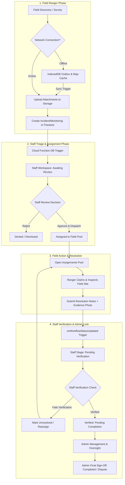

# WMIRS Submission System: Audit, Code Review & Improvement Strategy

**System:** Watershed Monitoring & Incident Reporting System (WMIRS)  
**Date:** September 2026  
**Review Type:** Code Review & Architectural Audit (`code-review-ai-ai-review` + `brainstorming`)  
**Scope:** Forest Ranger Field Submission ➔ Staff Triage & Verification ➔ Admin Final Approval

---

## 1. Executive Summary

This document details an end-to-end architectural audit and code review of the WMIRS submission pipeline. The system coordinates environmental reporting and ecological monitoring across the Tayabas watershed, operating across three primary user roles: **Forest Rangers** (field reporters and incident resolvers), **Staff Officers** (sector-specific triage and verification agents), and **System Administrators** (overall authority and final sign-off).

> [!NOTE]
> ### Implementation & Resolution Status (Updated September 2026)
> Several critical security, stability, and workflow items identified in this audit have been successfully resolved and deployed:
> * **[x] Finding 1 (Runtime Crash on Resolution Evidence):** Resolved. DOM `File` is uploaded to Firebase Storage prior to Firestore write.
> * **[x] Finding 5 & Section 4.1 (Notification Disconnect & Ping-Pong):** Resolved & Deployed. Resolution alerts route directly to assigning Staff Officers with action links to `/staff/workspace/verification`.
> * **[x] Finding 7 (Status Casing Inconsistency):** Resolved. Standardized on `LOG_STATUS.SUBMITTED` (`"submitted"`).
> * **[x] Section 4.2 ("Tragedy of the Commons" Broadcast Trap):** Resolved & Deployed. Replaced open blast with targeted Team Leader & Member dispatching with sole leader resolution authority.
> * **[x] Section 4.5 (Self-Audit Conflict of Interest):** Resolved. Hard invariant in `incidentService.js` and UI exclusion in `TeamAssignmentPicker.jsx` preventing self-assignment.
> * **[x] Pillar 1 - Idempotency Keys:** Resolved. Client UUID `clientSubmissionId` attached to all submissions to prevent duplicate creation on network retries.
> * **[x] Pillar 2 - Duplicate Detection & Smart Merge:** Resolved. 0-to-1 read duplicate detector + `DuplicateWarningBanner` + `smartMergeDuplicate` + `LOG_STATUS.MERGED_DUPLICATE`.
> * **[x] Security Rules Hardening:** Resolved & Deployed. `firestore.rules` updated and deployed to allow `assignedTeam`, `possibleDuplicate`, `mergedReports`, and `mergedInto`.
> * **[x] UI Overhaul:** Resolved. Open Assignments redesigned with zero emojis (Material Symbols exclusively), responsive unified toolbar, and strict SRP compliance (<150 lines).

While the system possesses strong foundational capabilities—including an IndexedDB offline outbox, raster tile preloading, and real-time Firestore listeners—the audit identified **critical runtime bugs**, **security permission gaps**, **broken notification routes**, and **architectural anti-patterns** that impede reliability and operational scalability.

---

## 2. End-to-End System Architecture & Lifecycle



---

## 3. Comprehensive Code Review Audit (`code-review-ai-ai-review`)

### Finding 1: Unhandled DOM `File` Object Passed to Firestore (Runtime Crash) — **[x] RESOLVED**
* **File:** [`src/components/common/RangerResolutionModal.jsx`](file:///d:/repos/WMIRS-SYSTEM-main/src/components/common/RangerResolutionModal.jsx#L32) & [`src/firebase/services/incidentService.js`](file:///d:/repos/WMIRS-SYSTEM-main/src/firebase/services/incidentService.js#L328)
* **Severity:** <span style="color: #ef4444; font-weight: bold;">CRITICAL</span>
* **Status:** <span style="color: #00ed64; font-weight: bold;">[x] RESOLVED</span>
* **Resolution Notes:** Implemented storage pre-upload in `resolveAssignmentByRanger` in `incidentService.js` via `uploadEvidenceFile(uid, id, evidenceFile)`. Stored metadata `{ name, url, type }` in Firestore rather than raw DOM `File`. Added progress indicator and leader-only guard in `RangerResolutionModal.jsx`.
* **Category:** Bug / Data Integrity
* **Impact:** Prevents rangers from submitting photo-verified field resolutions.
* **Description:** When a Forest Ranger resolves an assignment and selects a photo or document attachment, `RangerResolutionModal.jsx` takes the raw browser `File` object from `e.target.files[0]` and passes it directly to `resolveAssignmentByRanger()`. In `incidentService.js`, `updateLogWorkflowStatus` sets `historyEntry.evidenceFile = evidenceFile` and `updatePayload.resolutionEvidence = evidenceFile`, passing the raw DOM `File` object directly into `updateDoc()`. **Firestore rejects custom browser `File` objects with an unhandled exception**, crashing the submission and preventing rangers from submitting photo-verified resolutions.

```javascript
// ❌ Current Flawed Code in incidentService.js:
export const updateLogWorkflowStatus = async (id, logType, newStatus, uid, name, actionNotes = "", evidenceFile = null) => {
  ...
  if (evidenceFile) {
    historyEntry.evidenceFile = evidenceFile; // 💥 DOM File cannot be saved to Firestore
  }
  ...
  return updateDoc(docRef, updatePayload);
};

// ✅ Secure Resolution Pattern:
// Upload the file to Firebase Storage first, then store the URL and metadata
let uploadedEvidence = null;
if (evidenceFile instanceof File) {
  uploadedEvidence = await uploadResolutionEvidenceFile(uid, id, evidenceFile);
}
historyEntry.evidenceFile = uploadedEvidence; // Stores { name, url, type }
```

---

### Finding 2: Overly Permissive Storage Rules (BOLA / IDOR)
* **File:** [`storage.rules`](file:///d:/repos/WMIRS-SYSTEM-main/storage.rules#L16)
* **Severity:** <span style="color: #ef4444; font-weight: bold;">HIGH</span>
* **Category:** Security / Authorization
* **Impact:** Any authenticated user can modify, overwrite, or delete another user's evidence.
* **Description:** `storage.rules` contains the rule `match /users/{userId}/evidence/{allPaths=**} { allow read, write: if request.auth != null; }`. Because `write` is permitted for any authenticated user, any user can overwrite or delete photos submitted by another ranger or citizen. Furthermore, `storage.rules` lacks an `isAdmin()` helper, causing administrative cleanup functions (`deleteObject`) to fail for non-evidence user directories.

```javascript
// ❌ Current storage.rules:
match /users/{userId}/evidence/{allPaths=**} {
  allow read, write: if request.auth != null;
}

// ✅ Correct Least-Privilege Rules:
match /users/{userId}/evidence/{allPaths=**} {
  allow read: if request.auth != null;
  allow write: if request.auth != null && (request.auth.uid == userId || isAdmin());
}
```

---

### Finding 3: Unvetted / Pending Accounts Can Direct-Write to Database
* **File:** [`firestore.rules`](file:///d:/repos/WMIRS-SYSTEM-main/firestore.rules#L76), [`firestore.rules`](file:///d:/repos/WMIRS-SYSTEM-main/firestore.rules#L105)
* **Severity:** <span style="color: #f59e0b; font-weight: bold;">HIGH</span>
* **Category:** Security / Access Control
* **Impact:** Unvetted users can bypass UI guards and inject reports directly into Firestore.
* **Description:** Both `incidents` and `monitoring` collections allow document creation if `isAuthenticated() && request.resource.data.reporter.uid == request.auth.uid`. A new user with role `pending` (awaiting admin verification) can directly invoke `createIncidentReport` or write directly using client SDKs, completely bypassing the `/submit` UI route guard.

```javascript
// ❌ Current firestore.rules:
allow create: if isAuthenticated() && 
              request.resource.data.reporter.uid == request.auth.uid;

// ✅ Secure Role Verification:
allow create: if isAuthenticated() && 
              (isRanger() || isStaff() || isAdmin()) &&
              request.resource.data.reporter.uid == request.auth.uid;
```

---

### Finding 4: Dead Links in Notification Triggers
* **File:** [`functions/src/triggers/db/onIncidentCreated.js`](file:///d:/repos/WMIRS-SYSTEM-main/functions/src/triggers/db/onIncidentCreated.js#L68), [`functions/src/triggers/db/onMonitoringCreated.js`](file:///d:/repos/WMIRS-SYSTEM-main/functions/src/triggers/db/onMonitoringCreated.js#L69), [`functions/src/triggers/db/onWorkflowStatusUpdated.js`](file:///d:/repos/WMIRS-SYSTEM-main/functions/src/triggers/db/onWorkflowStatusUpdated.js#L43)
* **Severity:** <span style="color: #f59e0b; font-weight: bold;">MEDIUM</span>
* **Category:** Integration / Navigation
* **Impact:** Clicking in-app notifications redirects users to dead routes and bounces them to Landing.
* **Description:** Automated Cloud Functions generate notification links that do not match `AppRoutes.jsx`:
  * `/staff/incidents?id=...` ➔ Route does not exist; staff routes are under `/staff/workspace/:stageId`.
  * `/staff/bms?id=...` ➔ Route does not exist.
  * `/history` ➔ Route does not exist; active routes are `/incidents/history` and `/monitoring/history`.
  * `/open-assignments` ➔ Route in `AppRoutes.jsx` is `/assignments`.

---

### Finding 5: Notification Recipient Disconnect (Staff vs Admin Verification) — **[x] RESOLVED**
* **File:** [`functions/src/triggers/db/onWorkflowStatusUpdated.js`](file:///d:/repos/WMIRS-SYSTEM-main/functions/src/triggers/db/onWorkflowStatusUpdated.js#L87-L112)
* **Severity:** <span style="color: #f59e0b; font-weight: bold;">MEDIUM</span>
* **Status:** <span style="color: #00ed64; font-weight: bold;">[x] RESOLVED & DEPLOYED</span>
* **Resolution Notes:** Refactored Cloud Function trigger `onWorkflowStatusUpdated.js` to dispatch notification directly to `assignedTeam.assignedBy.uid` with direct deep link `/staff/workspace/verification`. Deployed to Firebase.
* **Category:** Workflow Orchestration
* **Impact:** Staff members are not alerted when rangers complete field assignments in their sector.
* **Description:** When a ranger resolves an assignment (moving status to `resolved`), `onWorkflowStatusUpdated.js` dispatches alerts exclusively to **Admins**. However, the UI workflow dictates that **Staff Officers** review and verify `resolved` logs (advancing them to `verified` or bouncing them to `unresolved`). Staff officers receive no notification when field tasks in their category are completed.

---

### Finding 6: Monolithic Staff Dashboard (Single Responsibility Violation)
* **File:** [`src/pages/Staff/StaffDashboard.jsx`](file:///d:/repos/WMIRS-SYSTEM-main/src/pages/Staff/StaffDashboard.jsx)
* **Severity:** <span style="color: #f59e0b; font-weight: bold;">MEDIUM</span>
* **Category:** Maintainability / Clean Architecture
* **Impact:** High fragility, high merge conflict risk, difficult testing and review.
* **Description:** `StaffDashboard.jsx` spans **2,389 lines of code**, violating the project's `<RULE[security-coding.md]>` mandate to keep components under 150 lines. It bundles SVG gauge renderers, sector charts (BMS, Water, Compliance, Incidents), filtering reducers, and table drawers into one file.

---

### Finding 7: Status Casing Inconsistency — **[x] RESOLVED**
* **File:** [`src/firebase/services/incidentService.js`](file:///d:/repos/WMIRS-SYSTEM-main/src/firebase/services/incidentService.js#L105) vs [`src/firebase/services/monitoringService.js`](file:///d:/repos/WMIRS-SYSTEM-main/src/firebase/services/monitoringService.js#L89)
* **Severity:** <span style="color: #3b82f6; font-weight: bold;">LOW</span>
* **Status:** <span style="color: #00ed64; font-weight: bold;">[x] RESOLVED</span>
* **Resolution Notes:** Standardized status assignment in `createIncidentReport` on `LOG_STATUS.SUBMITTED` (`"submitted"` lowercase), matching `monitoringService.js` and `incidentConstants.js`.
* **Category:** Code Quality / Database Consistency
* **Impact:** Inconsistent indexing, potential missed results during composite queries.
* **Description:** Incident reports are created with `status: "Submitted"` (capitalized), whereas monitoring logs use `LOG_STATUS.SUBMITTED` (`"submitted"`, lowercase). All status values should standardize on lowercase string enums matching `LOG_STATUS`.

---

## 4. Deep-Dive: Workflow State Machine & Logical Flaws (Ranger ➔ Staff ➔ Admin)

Beyond isolated code bugs, an analysis of the end-to-end data lifecycle reveals seven critical logical bottlenecks in how records transition between field officers, desk staff, and leadership:

### 4.1 The Inverted Alert Logic ("Notification Ping-Pong") — **[x] RESOLVED**
* **Status:** <span style="color: #00ed64; font-weight: bold;">[x] RESOLVED & DEPLOYED</span>
* **Resolution:** In `onWorkflowStatusUpdated.js`, resolution notifications now route directly to the assigning Staff Officer (`assignedTeam.assignedBy.uid`) and sector staff with deep-link `/staff/workspace/verification`.
```
[Ranger Resolves Field Assignment] 
               │
               ▼ (onWorkflowStatusUpdated fires)
       [Alert Dispatched to: ASSIGNING STAFF OFFICER] 
               │
               └──✅── Staff clicks link directly to /staff/workspace/verification!
```
* **The Disconnect:** When a Ranger marks an assignment `resolved`, `onWorkflowStatusUpdated.js` lines 86–112 dispatches alerts exclusively to **Admins**. However, in `IncidentDetailsModal.jsx` line 322, the action button to "Verify Resolution" is conditioned strictly on `userRole === "staff"`.
* **Consequence:** Admins receive alerts for actions they cannot take from the modal, while the Staff officer in charge of that ecological sector remains unaware that field inspection proof has arrived.

---

### 4.2 The "Tragedy of the Commons" Broadcast Trap — **[x] RESOLVED**
* **Status:** <span style="color: #00ed64; font-weight: bold;">[x] RESOLVED & DEPLOYED</span>
* **Resolution:**
  1. Built `TeamAssignmentPicker.jsx` for Staff review drawer allowing selection of a designated **Team Leader** and optional **Team Members**.
  2. Implemented `assignTeamToReport` in `incidentService.js` recording `assignedTeam: { leader, members, assignedAt, assignedBy }`.
  3. Replaced open broadcast in `onWorkflowStatusUpdated.js` with targeted alerts to the Team Leader (`"New Field Assignment: Team Leader"`) and individual members (`"New Field Assignment: Team Member"`).
  4. Restricted resolution submission authority strictly to the designated Team Leader in `resolveAssignmentByRanger` and UI cards.
* **The Disconnect:** When Staff marks a report as `assigned`, the system queries every user in the entire system with `role: "ranger"` and broadcasts a generic notification (`onWorkflowStatusUpdated.js:59`).
* **Consequence:**
  1. **Zero Personal Ownership:** An open broadcast to 20+ rangers means no specific officer is accountable.
  2. **No Claim / In-Route Lock:** Two rangers can independently travel to the same site and attempt to resolve the same incident simultaneously.
  3. **No Geographic Filtering:** Rangers assigned to North Tayabas receive alerts for incidents 30 km away in South Tayabas.

---

### 4.3 The "Verified" Silent Stalemate (Missing Admin Handoff)
* **The Disconnect:** When Staff verifies resolution proof, status moves to `verified` ("Pending Completion").
* **Consequence:** `onWorkflowStatusUpdated.js` does **not** have a handler for status `verified`. No notification is ever dispatched to Administrators that a report is ready for executive review and closure. Reports remain stagnant in "Pending Completion" unless an Admin actively searches the tab.

---

### 4.4 Lack of Concurrency Control (Double-Staff Review Conflict)
* **The Disconnect:** Staff reviews in `incidentService.js` call `updateDoc()` directly without Firestore transactions (`runTransaction`).
* **Consequence:** If Officer A approves a report to `assigned` at 10:00:01 AM while Officer B rejects it as `denied` at 10:00:02 AM, the last write silently clobbers the first, corrupting workflow progression and creating duplicate/contradictory history trails.

---

### 4.5 Self-Audit & Conflict of Interest Loophole — **[x] RESOLVED**
* **Status:** <span style="color: #00ed64; font-weight: bold;">[x] RESOLVED</span>
* **Resolution:**
  1. In `TeamAssignmentPicker.jsx`, the reporting ranger (`reporterUid`) is filtered out of both the Team Leader and Team Member selection lists.
  2. In `assignTeamToReport` (`incidentService.js`), a hard invariant check verifies `leader.uid !== reporterUid` and `members.every(m => m.uid !== reporterUid)`, rejecting any conflict of interest with an explicit error.
* **The Disconnect:** Rangers both report field incidents (e.g. tree cutting) and resolve field assignments.
* **Consequence:** The system lacks an invariant check (`reporter.uid !== resolver.uid`). A ranger who files an incident can claim the assignment from the open pool and verify/resolve their own report without independent peer inspection.

---

### 4.6 Disconnected Scope Architecture (Incidents vs. Monitoring)
* **The Disconnect:**
  * Monitoring logs are strictly partitioned by sector: `BMS`, `Water`, `Compliance`.
  * Incident reports are grouped under a single, catch-all `staffScope: "incidents"`.
* **Consequence:** A water management specialist with `staffScope: "Water"` can analyze water monitoring logs, but has zero access to triage or investigate a critical **River Contamination Incident** filed under Incidents.

---

### 4.7 Degraded Audit Trail Schema (`authorRole` Lost)
* **The Disconnect:** `updateLogWorkflowStatus` in `incidentService.js` appends `{ action, by, uid, timestamp, notes }`, omitting the actor's role.
* **Consequence:** `IncidentDetailsModal.jsx` defaults to rendering `By: [Name] (User)` for all new timeline items, stripping the audit log of whether an action was an official staff triage, a field ranger inspection, or an administrative override.

---

### 4.8 Data Flow Blueprint: Current vs. Improved Lifecycle

```
CURRENT FRAGILE FLOW:
[Ranger Submits] ➔ [All Staff/Admin Pinged] ➔ [Staff Assigns] ➔ [BLAST to ALL Rangers]
  ➔ [Ranger Resolves] ➔ [Alert to Admin (Dead-end)] ➔ [Silent Wait for Closure]

PROPOSED ROBUST FLOW:
1. [Field Capture]
   ├─► Client UUID idempotency (zero duplicates on dropped connection).
   └─► GPS accuracy verification (<30m threshold).
2. [Targeted Triage & Dispatch]
   ├─► Sector-based auto-routing (Water Incidents ➔ Water Staff).
   └─► Targeted Ranger Assignment (with optional "Claim & Lock" pool).
3. [Field Verification with Proof]
   ├─► Resolution requires Before/After photo + GPS proximity validation (<200m).
   └─► Auto-alert dispatched directly to assigned Staff Officer.
4. [Staff Sector Verification]
   ├─► Staff inspects Before/After photo drawer, advances to "Verified".
   └─► Cloud Function notifies Admin: "Executive Sign-Off Required".
5. [Admin Executive Seal & Dossier Export]
   ├─► Admin reviews and marks "Completed".
   └─► Automated generation of official ENRO PDF dossier with tamper-evident audit history.
```

---

## 5. Brainstorming Improvement Roadmap

```
┌─────────────────────────────────────────────────────────────────────────────┐
│                    FIVE STRATEGIC IMPROVEMENT PILLARS                       │
├───────────────────────┬─────────────────────────────┬───────────────────────┤
│ 1. Field Capture &    │ 2. Smart Triage &           │ 3. Task Assignment &  │
│    Offline Sync       │    Automated Escalation     │    Field Dispatch     │
│ • Geolocation lock    │ • Severity-based auto-alert │ • Targeted ranger     │
│ • Idempotent outbox   │ • Stale report auto-bump    │   dispatch vs pool    │
│ • Real-time compress  │ • Automated duplicate detect│ • GPS proximity match │
├───────────────────────┼─────────────────────────────┴───────────────────────┤
│ 4. Verification &     │ 5. Auditability, SLA &                              │
│    Resolution Proof   │    Admin Sign-Off                                   │
│ • Before/After photo  │ • Time-to-resolution SLA gauges                     │
│   comparison modal    │ • Two-step admin cryptographic or digital seal      │
│ • Chain of custody    │ • One-click PDF incident resolution export          │
└───────────────────────┴─────────────────────────────────────────────────────┘
```

### Pillar 1: Robust Field Capture & Resilient Offline Sync
1. **[x] Idempotency Keys:** Assign a client-generated UUID (`clientSubmissionId`) to every submission before sync. Implemented in `createIncidentReport` (`incidentService.js`) using `crypto.randomUUID()` and document keyed writes (`setDoc(doc(db, "incidents", id))`), preventing duplicate creation on network retry.
2. **GPS Accuracy Validation:** Reject or flag coordinate captures with excessive horizontal inaccuracy (>30 meters) to ensure rangers do not submit inaccurate field tags.
3. **Exponential Backoff & Dead-Letter Queue:** If an outbox entry fails to sync due to a corrupt payload, quarantine it to an outbox error drawer rather than stalling the sync queue.

### Pillar 2: Smart Triage & Automated SLA Escalation
1. **Critical Incident Escalation:** If a "Critical" or "High" severity incident remains in "Submitted" status for more than 4 hours without staff review, automatically escalate it directly to the Administrator.
2. **[x] Spatial Deduplication Warning & Smart Merge:** Implemented 1-read composite index query (`detectActiveDuplicate`) detecting matching category and location in active states. Built `DuplicateWarningBanner.jsx` in staff review drawer with `smartMergeDuplicate` action to incorporate notes/evidence into active master ticket and assign `LOG_STATUS.MERGED_DUPLICATE`.

### Pillar 3: Targeted Field Dispatch vs. "Open Grab"
1. **[x] Direct Ranger Team Assignment:** Built `TeamAssignmentPicker.jsx` allowing Staff to designate a Team Leader and assisting Members with role badges and targeted notifications, eliminating the broadcast trap.
2. **Assignment Acknowledgment:** Add an "Accepted" or "In-Route" micro-state so staff know when a ranger is actively en route to inspect an illegal logging or water contamination site.

### Pillar 4: High-Trust Verification & Before/After Proof
1. **Side-by-Side Verification Drawer:** Upgrade `StaffWorkspaceModals` to present an interactive Before/After viewer comparing the initial incident photo with the ranger's resolution evidence.
2. **GPS Proximity Verification on Resolution:** Validate that the ranger's resolution photo was captured within 200 meters of the initial incident coordinates to guarantee physical on-site inspection.

### Pillar 5: Comprehensive Auditing & Administrative Sign-Off
1. **Admin Universal Action Drawer:** Enable Administrators to take review actions directly from any modal, regardless of whether the report is in "Submitted", "Assigned", or "Verified" status.
2. **One-Click Official ENRO Dossier Export:** Generate signed, printable PDF incident reports containing full tamper-evident audit history timestamps, GPS maps, and evidence photos for local government records.

---

## 6. Recommended Phased Implementation Plan

| Phase | Focus Area | Deliverables | Status |
| :--- | :--- | :--- | :--- |
| **Phase 1** | **Core Bug & Security Fixes** | Fix resolution evidence upload crash; secure `storage.rules` and `firestore.rules`; fix broken notification links and notification routing. | **[IN PROGRESS]**<br>• Finding 1: Done<br>• Finding 7: Done<br>• `firestore.rules` whitelist: Done<br>• Finding 2 (`storage.rules`) & Finding 3 (`create` roles): Pending |
| **Phase 2** | **Workflow State Machine & Handshake** | Fix notification ping-pong (notify staff on resolution, notify admin on verification); add `authorRole` to history; enforce self-resolution guard. | **[IN PROGRESS]**<br>• 4.1 & Finding 5: Done<br>• 4.5 Self-Audit Guard: Done<br>• 4.3 Verified Handoff: Pending |
| **Phase 3** | **Verification Engine Upgrade** | Implement Before/After photo resolution comparator in staff/admin drawers; allow direct ranger dispatching and claim lock. | **[IN PROGRESS]**<br>• 4.2 Direct Team Dispatch & Leader Authority: Done<br>• Duplicate Banner & Smart Merge: Done<br>• Open Assignments UI Overhaul: Done<br>• Side-by-side comparator: Pending |
| **Phase 4** | **Field Sync & Mobile Resilience** | Add outbox idempotency tokens, coordinate accuracy checks, and retry quarantine logic. | **[IN PROGRESS]**<br>• Client UUID Idempotency: Done<br>• Accuracy validation: Pending |
| **Phase 5** | **Architectural Refactoring** | Decompose `StaffDashboard.jsx` (2,389 lines) into modular domain components complying with the 150-line SRP rule. | **[IN PROGRESS]**<br>• `OpenAssignments.jsx` decomposed to <150 lines: Done<br>• `StaffDashboard.jsx` decomposition: Pending |

---
*Document generated as part of the WMIRS Architectural Review & Continuous Quality Engineering initiative.*
